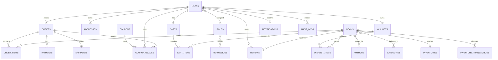

# ERD – BOOKSTORE

## Mermaid

## Quan hệ chính
- User 1-N Order.
- User 1-N Address.
- User 1-1 Cart.
- User N-N Role.
- Role N-N Permission.
- Book N-N Author.
- Book N-N Category.
- Cart 1-N CartItem.
- Order 1-N OrderItem.
- Order 1-N Payment.
- Order 1-1 Shipment.
- Book 1-1 Inventory.
- Book 1-N Review.
- User 1-1 Wishlist.
- Coupon 1-N CouponUsage.

OrderItem lưu snapshot tên và giá tại thời điểm mua.
